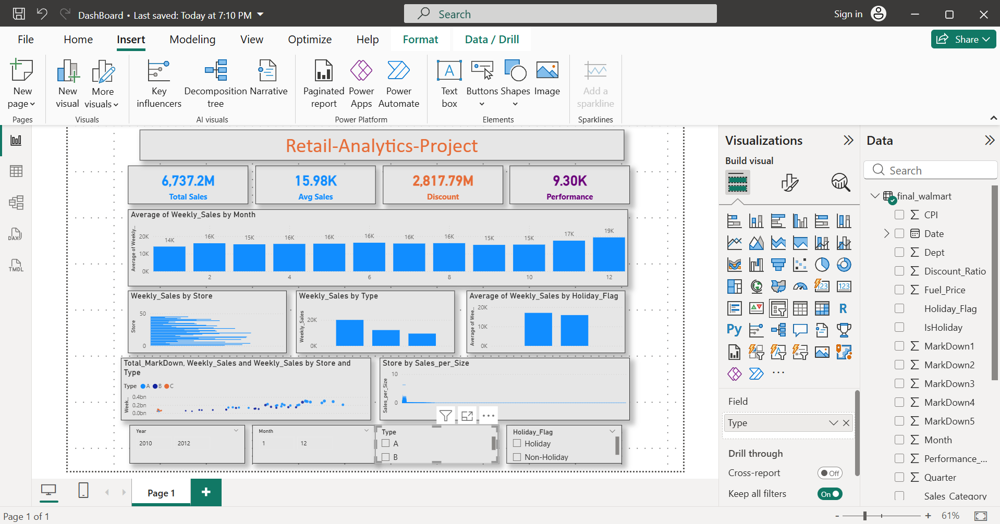
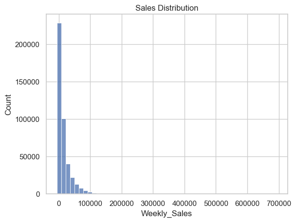
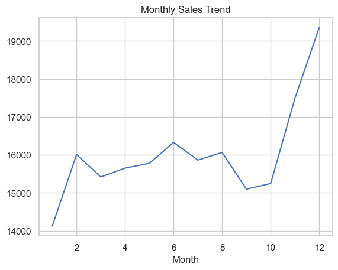
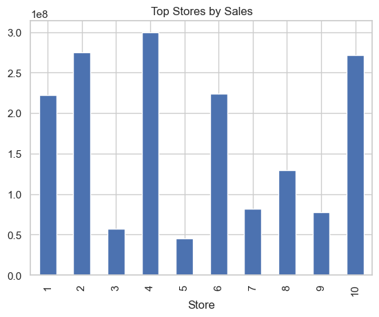
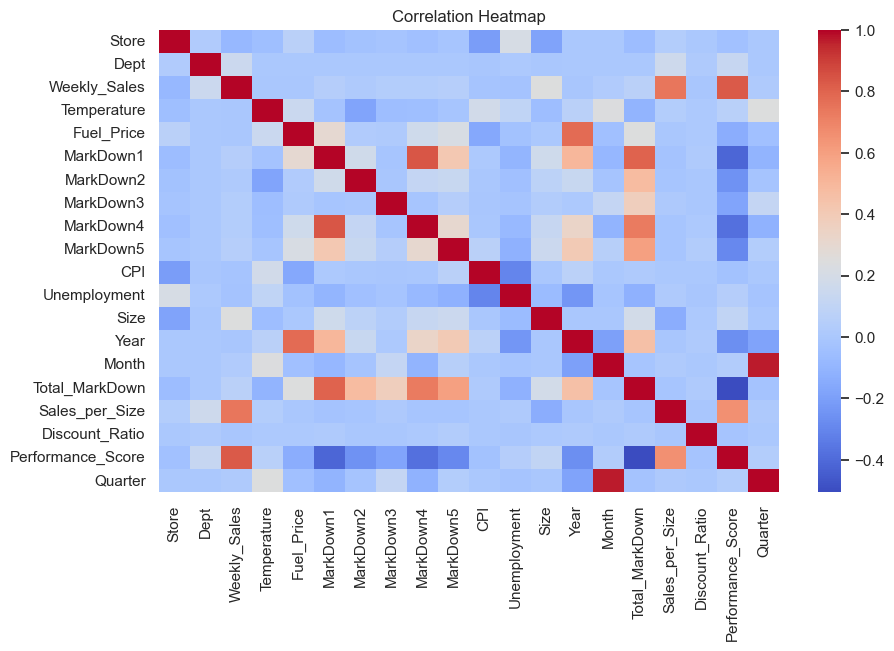

# Retail-Demand-Forecasting
End-to-End Walmart Sales Analytics Project using Python, SQL, and Power BI
# 📊 Walmart Sales Analytics Dashboard

🚀 End-to-End Data Analytics Project (14-Day Build)

---

## 🔍 OVERVIEW

This project analyzes Walmart retail data to uncover **sales trends, store performance, and the impact of discounts and holidays**.

The goal was to transform raw data into **actionable business insights** using a complete analytics workflow.

---

## 🧰 TECH STACK

• Python (Pandas, Matplotlib, Seaborn)
• SQL (SQLite)
• Power BI
• Jupyter Notebook

---

## ⚙️ PROJECT PIPELINE

Raw Data
→ Data Cleaning
→ Feature Engineering
→ SQL Analysis
→ Dashboard Creation
→ Insights

---

## 📁 PROJECT STRUCTURE

Retail-Demand-Forecasting/
│
├── data/
├── notebooks/
├── database/
├── dashboard/
├── images/
│
└── README.md

---

## 💡 KEY FEATURES

✔ Data cleaning and preprocessing
✔ Feature engineering (Discount Ratio, Performance Score, Sales Efficiency)
✔ SQL-based business analysis
✔ Interactive Power BI dashboard
✔ 20+ EDA visualizations with image export

---

## 📊 DASHBOARD PREVIEW

---

## 📈 EDA VISUALIZATIONS

### Sales Distribution

### Monthly Sales Trend

### Store Performance

### Discount vs Sales

### Correlation Heatmap

---

## 🔥 KEY INSIGHTS

📈 Sales follow strong seasonal trends with peaks during specific months

🎄 Holiday periods significantly increase customer spending

🏬 Larger stores consistently generate higher revenue

🎁 Discounts increase sales but reduce efficiency

⚖️ High sales does not always indicate strong performance

📉 External factors like fuel price and unemployment have minimal impact

⚡ Efficient stores perform better regardless of size

---

## 📊 EDA HIGHLIGHTS

• Sales distribution and outlier detection
• Monthly and quarterly trends
• Discount vs Sales relationship
• Efficiency analysis
• Correlation analysis

---

## 🚀 BUSINESS RECOMMENDATIONS

• Optimize discount strategies to balance revenue and efficiency
• Focus on high-performing stores and departments
• Use seasonal trends for planning and forecasting
• Improve efficiency in underperforming stores

---

## ▶️ HOW TO RUN

1. Open Jupyter Notebook for data analysis
2. Run SQL queries for insights
3. Open Power BI file (.pbix)
4. Explore dashboard using filters

---

## 🎯 WHAT I LEARNED

• Importance of data cleaning
• Feature engineering for deeper insights
• SQL for data analysis
• Dashboard design and storytelling
• Converting data into business decisions

---

## 👨‍💻 AUTHOR

Lucky Choudhary
B.Tech CSE Student
Aspiring Data Analyst

---

⭐ If you found this project useful, consider giving it a star!
